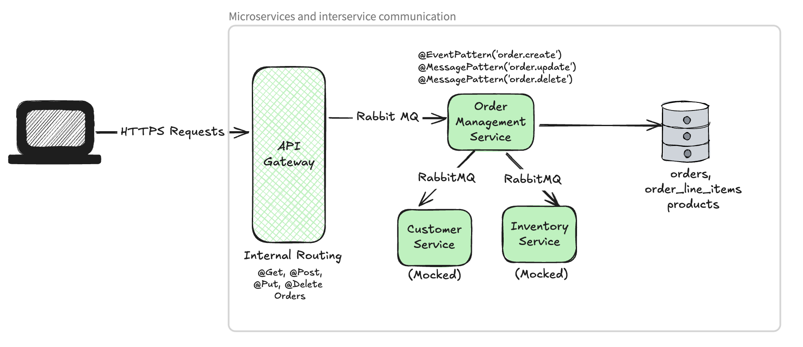
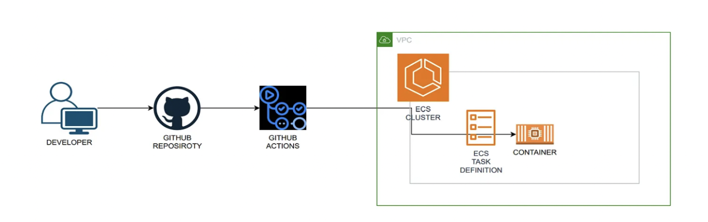
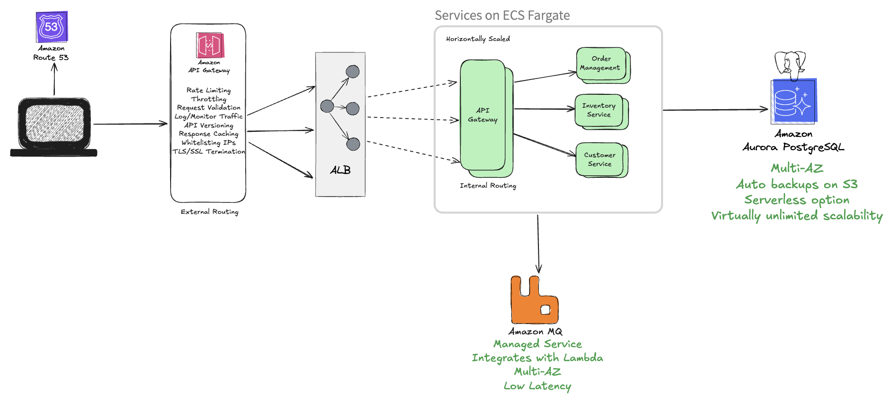

# NestJS+TS Based eCommerce Project

This monorepo project is a microservices-based architecture implemented using NestJS. It features services that communicate asynchronously through RabbitMQ and an API Gateway that acts as the entry point for external requests. The project uses TypeORM for database integration, leveraging Postgres as the database. TypeORM provides a robust and efficient way to manage database operations, ensuring data consistency and integrity. This ecommerce project is designed with scalability in mind to handle millions of orders efficiently.

---

## Quick Links

- [Scope](#scope)
- [Thought Process](#thought-process)
- [Folder Structure](#folder-structure)
- [Assumptions](#assumptions)
- [Known Limitations/Future Improvements](#known-limitationsfuture-improvements)
- [Interservice Communication](#interservice-communication)
- [Example Flows](#example-flows)
- [Database Schema and Relationships](#database-schema-and-relationships)
- [Locally Run Project](#locally-run-project)
- [Deployment Steps](#deployment-steps)
- [AWS Infra Setup](#aws-infra-setup-planned)

---

### Scope

1. API Gateway

   - Listens to HTTP requests and forwards them to message queues/microservices.

2. Order Management Service

   - Processes order-related messages from RabbitMQ.
   - Interacts with other services (e.g., Customer and Inventory) for data aggregation.
   - Interacts with the database

3. Customer Service (MOCKED)

   - Provides customer details based on incoming requests.

4. Inventory Service (MOCKED)
   - Responds with product/stock details.

## 

## Thought Process

- Used microservices for modularity: API Gateway, Order Management, Customer Service, and Inventory Service, each focusing on a single responsibility.
- Adopted a monorepo structure to centralize code, use shared libraries, simplifying maintenance and collaboration across services.
- Used API Gateway as a microservice for internal routing, ensuring that core services are not directly exposed for improved security and encapsulation.
- Used message queues to enable asynchronous interservice communication, ensuring reliable processing of order-related events.
- Shared DTOs/Interfaces/Constants etc to ensure consistent validation and reusability across microservices (in libs/common).
- Selected PostgreSQL as the database for its support for relational data, ACID compliance and SQL Transactions.

## Folder Structure

```plaintext
ecommerce/
├── apps/
│   ├── api-gateway/       # Handles external HTTP requests
│   ├── order-management/  # Handles order-related processing
│   ├── customer-service/  # Provides customer-related data [MOCKED Response]
│   ├── inventory-service/ # Manages inventory-related data [MOCKED Response]
├── libs/
│   ├── common/            # Shared utilities, constants, and DTOs
├── docker-compose.yml     # Microservices, RabbitMQ, Postgres setup
├── README.md              # Project documentation
└── package.json           # Project dependencies and scripts
```

## Assumptions

- Authentication is handled by the API Gateway through a mock implementation (mock token validation for customer CUST01).
- Customer Service is mocked, returning predefined customer details during order creation.
- Inventory Service is mocked to return product details when creating or updating an order.
- Interservice communication between microservices happens without authentication, as it's assumed to be internal communication within the trusted network.
- Scalability is assumed to be handled at the infrastructure level.
- All services are stateless, meaning they do not retain any user-specific/product specific data between requests.

## Known Limitations/Future Improvements

- The database lacks actual product/customer data.
- The libs/common directory is used for shared functionality but can become problematic as the codebase grows. A more sophisticated method, such as using a dedicated package (Nx) for shared contracts and utilities.
- All Dockerfiles are in the root directory for local setup, but production would require a different approach (dockerfile per service).
- The package.json is shared across microservices. In production, each service would have its own.
- Docker images are not optimized. Production images should be smaller.
- API responses are simplified and would require more robustness in production.
- No retry logic or dead letter queue for failed communication or message processing (assuming happy cases only).
- More comprehensive TS types and interfaces are needed.
- Message payloads are non-standard, DTOs could be used here as well if given more time.
- No central logger in place. Would need this in production for distributed tracing/debugging.
- No monitoring setup. Would set up alarms for metrics.
- Would add handling for high-transaction volumes, proper indexing and query optimization.
- Would provision IaC (CloudFormation/terraform) for easy infra setup and rollback.
- Would have Service Discovery in place using AWS CloudMap.
- Would implement circuit breakers to improve resilience and avoid cascading failures.

## Interservice Communication

Interservice communication in this system is based on RabbitMQ, using an event-driven approach. Communication Patterns used:

- Event Broadcasting (Emit)
- Direct Messaging (Send)

### Create Order

- API Gateway to Order Management via RabbitMQ [Event, Fire & Forget].

### Update Order

- API Gateway to Order Management via RabbitMQ [Direct Message, Producer-Consumer].
- Can evolve into an event for future services like Notifications to trigger user updates, etc.

### Delete Order

- API Gateway to Order Management via RabbitMQ [Direct Message, Producer-Consumer].
- Can evolve into an event for actions like notifying third-party shipping APIs.

## Example Flows

### Order Creation

1. Client sends a POST request to the API Gateway to create a new order.
2. API Gateway validates the request and forwards the order details to the Order Management Service via RabbitMQ.
3. Order Management Service processes the order, checking inventory and customer details.
4. Order Management Service sends a request to the Inventory Service to verify stock availability.
5. Inventory Service responds with the stock status.
6. Order Management Service sends a request to the Customer Service to retrieve customer information.
7. Customer Service responds with customer details.
8. Order Management Service aggregates the data and stores the order data in db.

### Order Update [Similar for Order Delete]

1. Client sends a PUT request to the API Gateway with updated shipping information or status.
2. API Gateway publishes a message to RabbitMQ for order update processing.
3. Order Management Service consumes the message, updates the order in the database.

## Database Schema and Relationships

### Order Table

- id, status, shipping_address, tracking_company, tracking_number, customer_id, total_amount, timestamps
- One-to-Many with OrderLineItem

### OrderLineItem Table

- id, order_id, product_id, quantity, unit_price, timestamps
- Many-to-One with Order
- Many-to-One with Product

### Product Table

- Id, name, unit_price, available_quantity, description, timestamps
- One-to-Many with OrderLineItem

### Customer Table

- Not created for this project, out of scope

\*No data actually present in DB

---

## Locally Run Project

Follow these steps to run the project locally using Docker Compose:

1. **Clone the Repository**  
   Clone the project repository to your local machine

2. **Set Environment Variables**  
   Ensure the `.env` file is present in the project root directory

   ```env
   NODE_ENV=development
   DB_HOST=postgres-db
   DB_NAME=ecommerce
   DB_USER=postgres
   DB_PASSWORD=postgres
   RABBITMQ_URL=amqp://host.docker.internal:5672
   RABBITMQ_ORDER_QUEUE=order-queue
   RABBITMQ_CUSTOMER_INFO_QUEUE=customer-info-queue
   RABBITMQ_INVENTORY_INFO_QUEUE=inventory-info-queue
   ```

3. **Build and Start Services**  
   Build and start the services using Docker Compose:

   ```bash
   docker-compose up --build
   ```

4. **Access the APIs**

   - API Gateway: [http://localhost:3000/api/v1/orders/health-check](http://localhost:3000)

5. **Stop the Services**  
   To stop the services, press `Ctrl+C` in the terminal and then run:

   ```bash
   docker-compose down
   ```

---

## Deployment Steps [Planned]



1.  **Set up GitHub Actions Workflow**

    - Check out the repository code on each push to the main branch.

2.  **Install Dependencies**

    - Install project dependencies using the `package.json` inside each service `apps/{service_name}/package.json`.

3.  **Build Docker Images**

    - Build Docker image for each microservice located in the `apps` folder using their respective `Dockerfile`.

4.  **Log in to Amazon ECR**

    - Use AWS credentials from GitHub Secrets to log in to Amazon Elastic Container Registry (ECR).

5.  **Push Docker Images**

    - Push the Docker images for each service to ECR with proper tagging (`latest` tag).

6.  **Fetch Configuration Secrets**

    - Fetch environment variables and other configuration secrets from AWS Parameter Store.

7.  **Update ECS Task Definitions**

    - Update the ECS task definitions with the latest image tags and environment variables retrieved in the previous step.

8.  **Deploy to ECS Cluster**
    - Deploy updated task definitions to the ECS cluster, ensuring the services are running on Fargate.

---

## AWS Infra Setup [Planned]

High Level Diagram Of AWS Infra for this project:



## Designing for High Availability, Scalability, and Fault Tolerance

### ECS with Fargate

- Services distributed across multiple Availability Zones for high availability.
- Auto-scaling adjusts the number of tasks based on traffic and load.
- Managed infrastructure ensures tasks are automatically rescheduled on healthy hosts in case of failures.

### ECR

- Fully managed container registry ensures high availability across AWS regions.
- Cross-region replication can be enabled for disaster recovery and global deployments.

### API Gateway

- Deployed across multiple AZs for consistent availability.
- Integrated throttling and caching protect backend services and handle traffic spikes.

### Application Load Balancer (ALB)

- Distributes incoming traffic across ECS tasks in multiple AZs.
- Health checks ensure traffic is routed only to healthy tasks.

### Amazon Aurora (Postgres)

- Multi-AZ deployment with automated failover ensures high availability.
- Auto-scaling read replicas handle increased query loads for scalability.
- Continuous backup to Amazon S3 and point-in-time recovery improve fault tolerance.

### Amazon MQ

- Deployed in redundant AZs for high availability.
- Active/standby brokers provide automatic failover in case of broker failure.
- Scales horizontally by adding more brokers to handle growing workloads.
